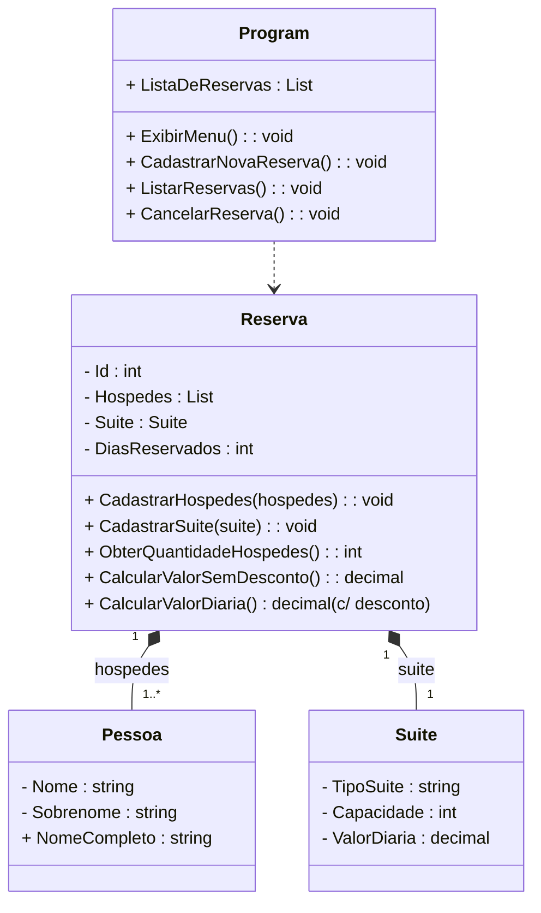

# SISTEMA DE RESERVA DE HOSPEDAGEM (C# .NET)


---

### **Índice**
* [📝 Descrição do Projeto](#-descrição-do-projeto)
* [⚙️ Tecnologias Utilizadas](#-tecnologias-utilizadas)
* [📁 Estrutura do Projeto](#-estrutura-do-projeto)
* [🔄 Fluxo de Funcionamento (UML Simplificado)](#-fluxo-de-funcionamento-uml-simplificado)
* [🚀 Funcionalidades e Demonstração](#-funcionalidades-e-demonstração)
* [💻 Como Usar a Aplicação](#-como-usar-a-aplicação)
* [✅ Conclusão](#-conclusão)

---

### 📝 **Descrição do Projeto**

Este projeto é um **Sistema de Reserva de Hospedagem** desenvolvido em C# utilizando os princípios de Programação Orientada a Objetos (POO). O sistema permite ao usuário cadastrar suítes, listar hóspedes e calcular o valor total da reserva, aplicando uma regra de negócio específica: **desconto de 10%** para reservas com mais de 10 dias. O sistema opera através de um menu interativo via console.

#### ⚙️ **Tecnologias Utilizadas**

* **Linguagem:** C#
* **Framework:** .NET (Console Application)
* **Paradigmas:** Programação Orientada a Objetos (POO)

#### 📁 **Estrutura do Projeto**

```
SistemaHospedagem/
├── Models/
│   ├── Pessoa.cs       # Classe para o Hóspede (Nome, Sobrenome)
│   ├── Suite.cs        # Classe para a Suíte (Tipo, Capacidade, ValorDiaria)
│   └── Reserva.cs      # Classe central de Regras de Negócio
├── Program.cs          # Ponto de entrada (Menu e Interação com o Usuário)
└── SistemaHospedagem.csproj
```
#### 🔄 **Fluxo de Funcionamento (UML Simplificado)**


---

### 🚀 **Funcionalidades e Demonstração**

#### **Principais Funcionalidades**

* **Cálculo de Diárias**: Calcula o valor total com base no preço da suíte e dias reservados.
* **Regra de Desconto**: Concede automaticamente **10% de desconto** se o período da reserva for superior a 10 dias.
* **Validação de Capacidade**: Impede o cadastro de hóspedes em número superior à capacidade máxima da suíte.
* **Menu Interativo**: Permite cadastrar, visualizar e cancelar reservas em um loop contínuo (opções 1, 2 e 3).
* **Visualização de Valores**: Mostra o valor **bruto** (sem desconto) e o valor **final** (com desconto) se a regra for aplicada.

#### **Como funciona**

O programa inicia com um menu principal (opções 1 a 4). Ao selecionar "1 - Cadastrar Nova Reserva", o sistema solicita interativamente:
1.  Detalhes da Suíte (tipo, capacidade, valor).
2.  Número de Dias da Reserva.
3.  Nome e Sobrenome de cada Hóspede.
Após o cadastro, o resultado do cálculo é exibido e a reserva é armazenada na memória (lista `ListaDeReservas`).

---

### 💻 **Como Usar a Aplicação**

1.  **Pré-requisitos:** Certifique-se de ter o **.NET SDK** instalado (versão 6.0 ou superior).
2.  **Clonar o Repositório:** (Se estiver no GitHub) `git clone https://www.youtube.com/watch?v=X49Wz3icO3E`
3.  **Navegar até a pasta:**
    ```bash
    cd SistemaHospedagem
    ```
4.  **Executar a Aplicação:**
    ```bash
    dotnet run
    ```
5.  Siga as instruções do menu no terminal para cadastrar, listar ou cancelar reservas.

---

### 👥 **Equipe do Projeto**
<a href="https://github.com/amaro-netto" title="Amaro Netto"></a>
---

### ✅ **Conclusão**

Este projeto demonstrou a aplicação prática de conceitos fundamentais de POO em C#, incluindo encapsulamento (propriedades e métodos), validação de dados e implementação de regras de negócio em um cenário de sistema de reservas. É uma base sólida para projetos mais complexos que envolvam gerenciamento de dados e interações do usuário.

---

### 📸 **Prévia do Projeto**

